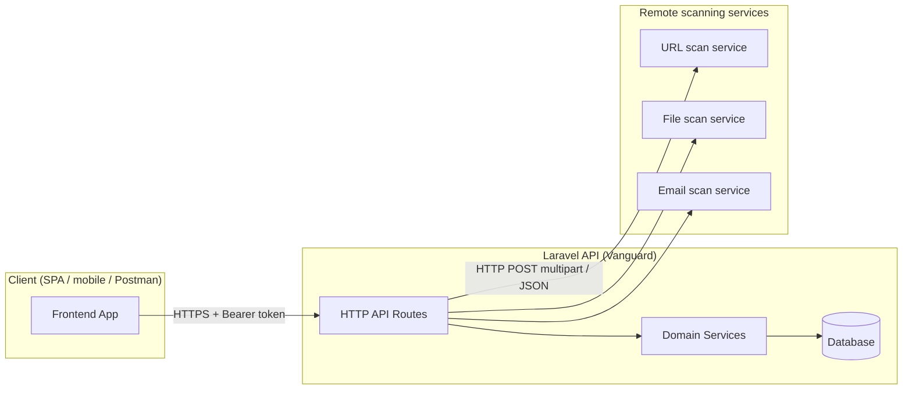
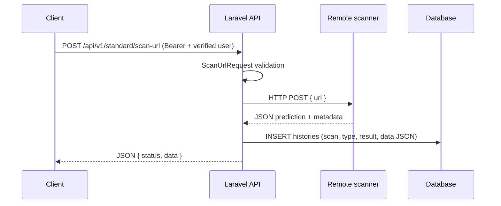
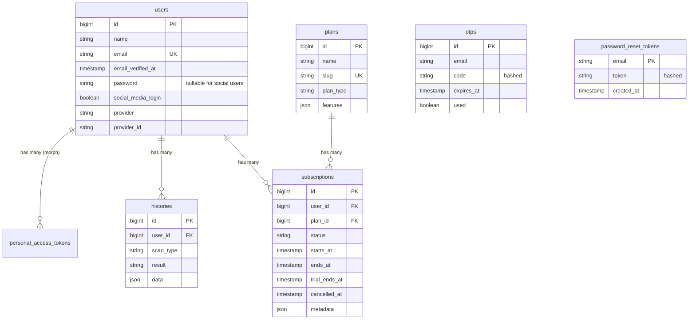
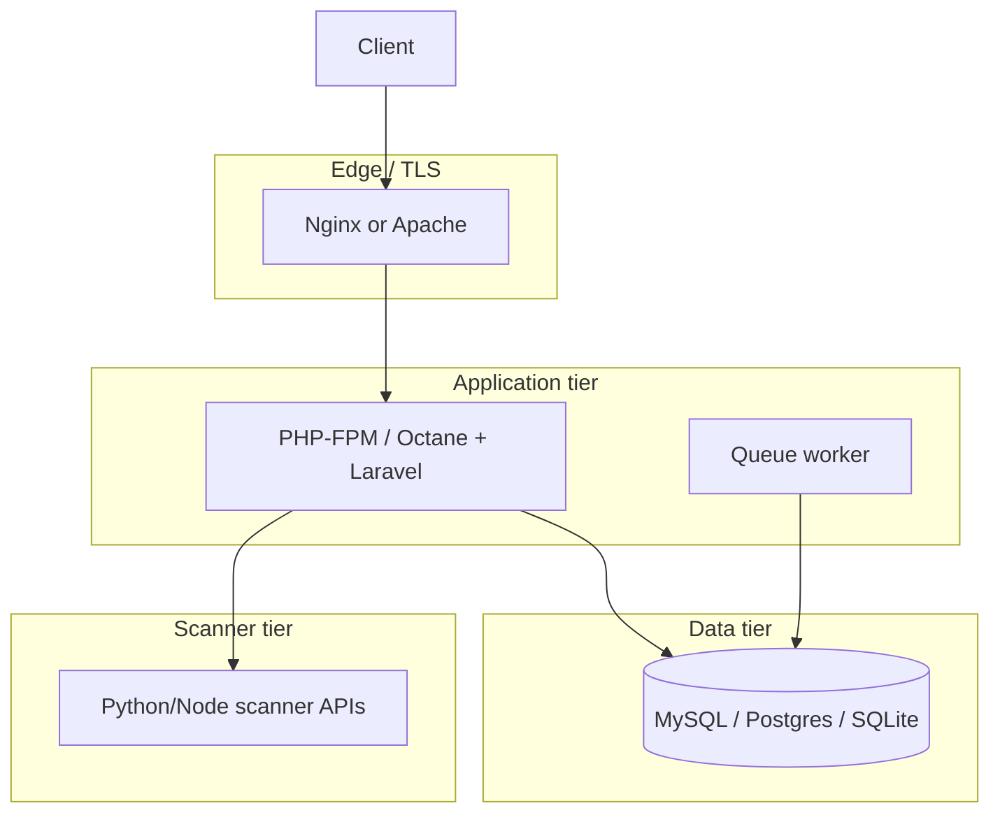

# Vanguard — Graduation Project Technical Report

This document provides a structured, evidence-based analysis of the **Vanguard** repository (workspace: `vanguard`). The codebase is primarily a **Laravel 12** JSON API backend that orchestrates **malware/phishing-style scanning** of URLs, files, and email artifacts by delegating inference to **external HTTP microservices**, while persisting **per-user scan history** and exposing a rich **authentication** surface (Sanctum tokens, email verification, OTP-based second step, password reset, and OAuth).

Unless stated otherwise, claims below are grounded in files under `d:\xampp\htdocs\vanguard`.

---

# Project Overview

## Project name

- **Repository / working name:** Vanguard (inferred from the project directory name `vanguard`).
- **Application display name (default):** `Laravel` via `APP_NAME` in `.env.example` and `config/app.php` — the team may wish to align branding with `APP_NAME=Vanguard` for documentation and deployment consistency.

## Purpose of the system

The backend acts as a **security scanning gateway** and **user account hub**: authenticated clients submit URLs or upload files (including email-like uploads), the application forwards those inputs to **remote scanning services** configured under `config/services.php` (`remote_server.*` keys), and stores structured results in the `histories` table for later retrieval and aggregation.

## Problem it solves

End users need a **centralized, account-bound** way to:

1. Submit potentially unsafe **URLs**, **files**, or **email** payloads for automated classification.
2. Receive a **prediction-style outcome** (the code expects a JSON field such as `data.prediction` from the remote service — see `ScanUrlController`, `ScanFileController`, `EmailScanController`).
3. Maintain an **audit trail** of scans (`histories`) and summarized statistics (via `App\Support\Services\HistoryService`).

## Main features

| Feature area | Evidence in codebase |
|--------------|----------------------|
| User registration with immediate API token | `AuthController::register`, `AuthService::register`, `routes/api.php` |
| Email verification (signed links, resend) | `EmailVerificationService`, `VerifyEmailNotification`, `routes/api.php` |
| Password login with **email OTP** (2FA-style step) | `AuthService::login`, `OtpService`, `routes/api.php` (`/login`, `/verify-otp`) |
| Password reset (token in email → SPA URL) | `PasswordResetService`, `ResetPasswordNotification` |
| OAuth (Google, Facebook, Twitter/X) stateless API flow | `SocialAuthService`, `AuthController::redirect` / `callback`, Laravel Socialite |
| Token-based API auth | Laravel Sanctum (`User` uses `HasApiTokens`), `auth:sanctum` middleware on protected routes |
| Verified-email gate for scanning | Route group in `routes/api.php` uses `middleware(['auth:sanctum', 'verified'])` |
| Standard vs advanced URL/file scan | `ScanUrlController`, `ScanFileController` (different remote endpoints) |
| Standard email scan (file upload to remote) | `EmailScanController::standardScanEmail` |
| Scan history + analytics payload | `HistoryController`, `App\Support\Services\HistoryService` |
| Subscription/plan data model (prepared, not wired to HTTP) | `Plan`, `Subscription` models and migrations |

## Target users

- **Primary:** End users or organizational clients consuming the API from a **separate frontend** (the presence of `FRONTEND_URL` in `.env.example` and `config/app.php` strongly implies a SPA on e.g. port `5173`).
- **Secondary:** Administrators or operators who deploy the Laravel API together with the **remote scanning microservices** (URLs default to `http://0.0.0.0:8001`–`8005` in `config/services.php`).

---

# System Architecture

## High-level architecture explanation

The system follows a **classic three-tier pattern** adapted for SPA/API usage:

1. **Presentation / client tier:** Not shipped as a full SPA inside this repository; the API is designed for an external client. The repo includes a **Laravel welcome page** (`routes/web.php`, `resources/views/welcome.blade.php`) and minimal Vite assets for Laravel’s default skeleton.
2. **Application tier:** Laravel 12 application (`app/`, `routes/`, `bootstrap/app.php`) exposing versioned REST-style JSON under `/api/v1/*`.
3. **Data tier:** SQL database accessed via Eloquent (default `.env.example` uses **SQLite**; MySQL/MariaDB remain supported via Laravel’s database configuration).

Remote **ML or rule-based scanning services** are treated as a separate tier reached through `Illuminate\Support\Facades\Http`.



## Frontend architecture

Within this repository, the “frontend” is **minimal**:

- **Blade + Tailwind:** `resources/views/welcome.blade.php` is the default Laravel landing page; styles load via Vite when built (`vite.config.js`).
- **JavaScript:** `resources/js/app.js` imports `bootstrap.js`, which configures **Axios** on `window.axios` for potential same-origin use — there is **no React/Vue application tree** in `resources/js/` at present.
- **Implied SPA:** `FRONTEND_URL` and password-reset links in `ResetPasswordNotification` point to routes such as `/reset-password` on the **external** frontend host, not Laravel’s `web` routes.

## Backend architecture

Laravel’s **layered MVC + services** organization:

- **HTTP layer:** `app/Http/Controllers/Api/V1/*` and `app/Http/Requests/Api/V1/*` (FormRequest validation).
- **Domain / application services:** `app/Services/*` encapsulate authentication, OTP, password reset, email verification, and social login orchestration.
- **Supporting utility service:** `app/Support/Services/HistoryService.php` aggregates history records (static methods).
- **Persistence:** Eloquent models in `app/Models/`.

Routing is registered in `bootstrap/app.php` via `->withRouting(api: routes/api.php, web: routes/web.php, ...)`.

## Data flow between components

**Authenticated scan (URL example):**



**Login with OTP:**

```mermaid
sequenceDiagram
  participant C as Client
  participant API as Laravel API
  participant DB as Database
  participant M as Mail transport

  C->>API: POST /api/v1/login
  API->>DB: Verify user + password hash
  API->>DB: INSERT otps (hashed code, expiry)
  API->>M: OtpNotification (plaintext code in email body)
  API-->>C: "code sent" message

  C->>API: POST /api/v1/verify-otp
  API->>DB: Load OTP, Hash::check code
  API->>DB: Mark OTP used; cleanup
  API->>DB: INSERT personal_access_tokens
  API-->>C: user + Sanctum plainTextToken
```

## Design patterns used (if any)

| Pattern | Where it appears | Rationale |
|---------|------------------|-----------|
| **Service layer** | `app/Services/AuthService.php`, `OtpService.php`, etc. | Keeps controllers thin; improves testability (see `tests/Feature/Api/V1/AuthControllerTest.php`). |
| **Form Request validation** | `app/Http/Requests/Api/V1/*` | Centralizes input rules for API endpoints. |
| **Repository-style DB access (light)** | `OtpService` uses `DB::table('otps')` | OTP rows are not modeled as Eloquent entities; direct query builder use is pragmatic for transient credentials. |
| **Static façade-style helper** | `App\Support\Services\HistoryService` | Convenient aggregation API for history; trade-off: harder to mock than instance services. |
| **OAuth abstraction** | `SocialAuthService` | Normalizes provider aliases (`x` → `twitter` driver) and user provisioning rules. |

---

# Technologies Used

Versions below are taken from `composer.json`, `composer.lock` (where pinned), and `package.json`.

| Technology | Version (detected) | Purpose in this project | Why it was likely chosen | Advantages here |
|------------|-------------------|-------------------------|---------------------------|-----------------|
| **PHP** | `^8.2` (`composer.json`) | Runtime for Laravel | Modern language features, performance improvements | Aligns with Laravel 12 requirements |
| **Laravel Framework** | `v12.36.1` (`composer.lock`) | Web framework, routing, HTTP, ORM, config | Full-stack ecosystem, rapid API development | Migrations, validation, mail, HTTP client, Sanctum integration |
| **Laravel Sanctum** | `v4.2.0` (`composer.lock`) | SPA/API token authentication | First-party, simple token issuance for JSON clients | `HasApiTokens` on `User`, `auth:sanctum` middleware |
| **Laravel Socialite** | `v5.23.1` (`composer.lock`) | OAuth with Google/Facebook/Twitter | Reduces OAuth protocol implementation burden | `Socialite::driver(...)->stateless()` fits API-only callbacks |
| **Laravel Tinker** | `^2.10.1` | REPL / debugging (`composer.json`) | Developer ergonomics | Interactive inspection in development |
| **PHPUnit** | `11.5.43` (`composer.lock`, require-dev) | Automated tests | Standard PHP testing stack | Substantial `AuthControllerTest` coverage |
| **Faker / Pail / Pint / Sail / Collision** | per `composer.json` (dev) | DX, formatting, Docker dev environment | Laravel default toolchain | `composer.json` `scripts.dev` runs concurrent dev processes |
| **Vite** | `^7.0.7` (`package.json`) | Frontend asset bundler | Laravel’s default since Vite adoption | Fast HMR for `resources/` assets |
| **laravel-vite-plugin** | `^2.0.0` | Bridges Laravel and Vite | Official integration | `@vite` in Blade templates |
| **Tailwind CSS** | `^4.0.0` + `@tailwindcss/vite` | Utility-first styling | Rapid UI for default welcome page | `resources/css/app.css` uses `@import 'tailwindcss'` |
| **Axios** | `^1.11.0` | HTTP client in browser bundle | Common choice for XHR/fetch wrapper | Pre-configured in `resources/js/bootstrap.js` |
| **Concurrently** | `^9.0.1` | Run multiple dev commands | Laravel `composer dev` script | Starts server, queue listener, logs, Vite together (`composer.json`) |

**Not present as active runtime dependencies in this repo:** Redis (only default env placeholders), Docker Compose manifests (though **Laravel Sail** exists as a dev dependency), Nginx configs (deployment-specific).

---

# Backend Analysis

## Framework structure

Standard **Laravel 12 skeleton** with `app/Http`, `app/Models`, `app/Services`, `app/Notifications`, `routes/api.php`, and `database/migrations`. Application bootstrap uses `bootstrap/app.php` (Laravel 11+ style) rather than the older `Kernel.php` split for routing.

## Important modules

| Module | Path(s) | Responsibility |
|--------|---------|------------------|
| API v1 routes | `routes/api.php` | Versioned public and protected endpoints |
| Authentication | `AuthController.php`, `AuthService.php`, `SocialAuthService.php` | Registration, login+OTP, OAuth, logout, `me` |
| Email lifecycle | `EmailVerificationService.php`, `VerifyEmailNotification.php` | Must-verify flow for protected scans |
| OTP | `OtpService.php`, `OtpNotification.php`, migration `create_otps_table` | Second factor after password validation |
| Password reset | `PasswordResetService.php`, `ResetPasswordNotification.php` | Custom token storage in `password_reset_tokens` |
| Scanning proxies | `ScanUrlController.php`, `ScanFileController.php`, `EmailScanController.php` | Validate input, call remote HTTP APIs, return JSON |
| History | `HistoryController.php`, `App\Support\Services\HistoryService.php`, `History.php` | Persist and summarize scans |

**Note:** `app/Services/HistoryService.php` duplicates part of the history-creation concern but **controllers import** `App\Support\Services\HistoryService` only. The duplicate file is effectively **dead code** unless referenced elsewhere.

## Authentication system

- **Primary mechanism:** Laravel Sanctum **personal access tokens** (`personal_access_tokens` table migration; `User` uses `HasApiTokens`).
- **Registration:** Creates user, hashes password (`User` model casts `password` to `hashed`), sends verification email, returns **token immediately** (`AuthService::register`) — be aware this means a client could call protected endpoints before verifying email, but `verified` middleware will still block scan routes until `email_verified_at` is set.
- **Login:** Does **not** return a token directly. Validates password, then `OtpService::generateAndSendOtp` emails a **6-digit** code valid for **10 minutes** (`OtpService` constants). Completion via `/verify-otp` mints a token.
- **Social login:** Stateless OAuth redirect and callback; on success returns JSON user + token (`AuthController::callback`).

## Authorization and permissions

The codebase uses **middleware-based access control**, not granular roles/policies:

| Concern | Implementation |
|---------|----------------|
| Authentication | `auth:sanctum` on `/logout`, `/me`, and all scan/history routes (`routes/api.php`). |
| Email verified | `verified` middleware on scan and history routes — `User` implements `Illuminate\Contracts\Auth\MustVerifyEmail`. |
| Provider allow-list | `SocialAuthService::validateProvider` and `where('provider', 'google|facebook|twitter|x')` constraints on routes. |

There is **no** Laravel Policy or Gates directory in the observed file tree; subscription/plan models are **not** enforced at the controller level yet.

## API structure

- **Base prefix:** `/api/v1` (`routes/api.php`).
- **Public endpoints:** `register`, `login`, `verify-otp`, password reset, email verification notification, OAuth redirect/callback, signed email verification URL.
- **Protected endpoints:** Standard/advanced scans, `GET /history`, `logout`, `me`.

## Services and business logic

Business rules are concentrated in `app/Services`:

- **`AuthService`** — coordinates registration, login challenge, OTP completion, token revocation on logout.
- **`OtpService`** — secure OTP storage using `Hash::make`, single-use semantics, cleanup of expired rows.
- **`PasswordResetService`** — hashed reset tokens, expiry based on `config/auth.php` (`expire` => 60 minutes), revokes **all** Sanctum tokens after reset.
- **`EmailVerificationService`** — hash equality check using `hash_equals` for the verification hash.
- **`SocialAuthService`** — maps social accounts to users, including linking by email and synthetic email when provider omits one (`{id}@{provider}.local`).

## Queues, jobs, events, schedulers

- **Queue configuration:** `.env.example` sets `QUEUE_CONNECTION=database`; migrations include `jobs`, `failed_jobs`, `job_batches` (`0001_01_01_000002_create_jobs_table.php`).
- **Application jobs:** No custom `app/Jobs` classes were found in the repository snapshot; queue infrastructure is **prepared** (Laravel default) rather than heavily used.
- **Scheduler:** `routes/console.php` only registers the sample `inspire` Artisan command — **no production cron definitions** in-repo.
- **Events/listeners:** No bespoke event classes surfaced in the file inventory.

## File storage strategy

- Uploaded scan inputs are read in-memory via `file_get_contents($request->file(...))` and streamed to remote services using `Http::attach` (`ScanFileController`, `EmailScanController`). **Files are not persisted to `storage/`** for scanning in the current implementation.
- `config/filesystems.php` remains available for future artifacts (quarantine storage, evidence retention).

## Security considerations

Strengths observable in code:

- Passwords stored with Laravel’s **hashed cast** on `User`.
- OTP codes stored as **bcrypt hashes**; plaintext only exists in the outbound email (`OtpNotification`).
- Password reset tokens stored as **hashes**; raw token only sent by email to the user.
- Email verification uses **signed URLs** (`VerifyEmailNotification` uses `URL::temporarySignedRoute`; route uses `signed` middleware + throttle).
- After password reset, **all API tokens** for the user are deleted (`PasswordResetService`).

Risks / gaps to treat explicitly in documentation or hardening passes:

- **Remote HTTP trust:** Scan controllers do not show TLS pinning, timeouts, or structured error handling for non-200 scanner responses — operational hardening is left to deployment.
- **History JSON:** Full remote JSON is stored — may contain sensitive excerpts from inputs depending on scanner behavior; consider retention policy.
- **`config/services.php`** duplicates the `'twitter'` array key twice — in PHP the **later definition wins**, which can hide misconfiguration mistakes.

---

# Frontend Analysis

## Framework structure

No React/Vue/Svelte single-page application resides under `resources/js/` beyond the Laravel starter. The repository’s UI is:

- `welcome.blade.php` — marketing-style landing (Laravel default).
- Tailwind-driven styling via Vite (`vite.config.js`, `resources/css/app.css`).

## State management

Not applicable beyond trivial globals (`window.axios` in `resources/js/bootstrap.js`). Application state for real users is expected to live in the **external SPA** referenced by `FRONTEND_URL`.

## Routing

- **Server-side:** `routes/web.php` exposes `/` only.
- **Client-side router:** Not part of this repository.

## UI components

Default Laravel welcome layout; no shared component library (e.g. Inertia/Vue components) in-tree.

## Forms and validation

API validation is **server-side** using FormRequest classes, e.g.:

- `ScanUrlRequest` — `url` required and must be a valid URL string.
- `ScanFileRequest` — uploaded `file` required.
- `EmailRequest` — field name `email` holds a **file** (`required|file`) — naming is unconventional but intentional for multipart upload.

## API communication

`bootstrap.js` configures Axios with `X-Requested-With: XMLHttpRequest` — typical Laravel AJAX integration. The actual scan client code is **not** in this repo.

## Responsive design approach

Tailwind utility classes in `welcome.blade.php` include responsive breakpoints (e.g. `lg:*` patterns) consistent with Tailwind’s mobile-first approach.

---

# Database Analysis

## Database Type

- **Engine (default configuration):** **SQLite** (`DB_CONNECTION=sqlite` in `.env.example`).
- **Why it fits:** Zero external DB daemon for local graduation demos; Laravel supports SQLite for rapid iteration. Production would commonly switch to **MySQL/PostgreSQL** via `config/database.php` without architectural change.

## ERD Description



### Main entities

- **User** — identity, credentials, OAuth linkage, verification timestamp.
- **History** — scan records tied to a user with JSON payload.
- **Plan / Subscription** — commercial/feature model scaffolding.
- **OTP** — transient second-factor codes (hashed at rest).
- **Personal access token** — Sanctum tokens.
- **Framework tables** — `sessions`, `cache`, `jobs`, `failed_jobs`, etc.

### Relationships

- `histories.user_id` → `users.id` (`ON DELETE CASCADE` in migration).
- `subscriptions.user_id` → `users.id` (`CASCADE`); `subscriptions.plan_id` → `plans.id` (`CASCADE`).
- **Model inconsistency:** `Plan::users()` declares `hasMany(User::class)` in `app/Models/Plan.php`, but **no `plan_id` foreign key** exists on `users` in migrations. Real user↔plan association in schema is through **`subscriptions`** only. This should be corrected (either add `plan_id` to users or remove/replace the relationship) to avoid misleading future contributors.

## Tables Analysis

### `users`

| Aspect | Detail |
|--------|--------|
| **Purpose** | Core identity record for authentication and profile. |
| **Primary key** | `id` (`bigIncrements`). |
| **Important fields** | `email` (unique), `password` (nullable after social migration `2025_11_03_194633_add_social_media_login_flag_in_users_table.php`), `email_verified_at`, `social_media_login`, `provider`, `provider_id` (indexed pair). |
| **Foreign keys** | None referencing outward from `users`. |
| **Relationships** | One-to-many `histories`, `subscriptions`; helper `activeSubscription()` query on `Subscription`. |

### `password_reset_tokens`

| Aspect | Detail |
|--------|--------|
| **Purpose** | Stores hashed reset tokens (custom flow, not always using Laravel’s built-in broker exclusively). |
| **Primary key** | `email` string primary. |
| **Foreign keys** | Logical link to `users.email`, not enforced as FK. |

### `sessions`

| Aspect | Detail |
|--------|--------|
| **Purpose** | Database session driver support (`.env.example` → `SESSION_DRIVER=database`). |
| **Primary key** | `id`. |
| **Foreign keys** | Nullable `user_id` → `users.id` (index). |

### `personal_access_tokens`

| Aspect | Detail |
|--------|--------|
| **Purpose** | Sanctum token storage for API authentication. |
| **Primary key** | `id`. |
| **Foreign keys** | Polymorphic `tokenable_id` / `tokenable_type` to `users`. |

### `otps`

| Aspect | Detail |
|--------|--------|
| **Purpose** | Email OTP challenge after successful password validation. |
| **Primary key** | `id`. |
| **Important fields** | `email`, `code` (hashed; length migration `2025_11_15_084004_update_otps_code_column_length.php`), `expires_at`, `used`. |
| **Indexes** | Composite index `email`, `code`, `used` plus `email` index. |

### `histories`

| Aspect | Detail |
|--------|--------|
| **Purpose** | Append-only style log of scans and raw scanner JSON. |
| **Primary key** | `id`. |
| **Foreign keys** | `user_id` → `users.id` (`CASCADE` on delete). |
| **Important fields** | `scan_type` (`file`, `url`, `email` per migration comments), `result` (nullable string; counted in `HistoryService`), `data` JSON. |

### `plans`

| Aspect | Detail |
|--------|--------|
| **Purpose** | Describes sellable tiers (free/essential/premium/enterprise constants in `Plan.php`). |
| **Primary key** | `id`. |
| **Important fields** | `slug` unique, `plan_type`, pricing, `features` JSON, `metadata` JSON, `is_active`, `sort_order`. |
| **Foreign keys** | None; referenced by `subscriptions.plan_id`. |

### `subscriptions`

| Aspect | Detail |
|--------|--------|
| **Purpose** | Binds a user to a plan over time with status and trial fields. |
| **Primary key** | `id`. |
| **Foreign keys** | `user_id` → `users.id`; `plan_id` → `plans.id` (both `CASCADE`). |
| **Important fields** | `status` (defaults to `active`), `starts_at`, `ends_at`, `trial_ends_at`, `cancelled_at`, `metadata`. |

### `cache` / `cache_locks`

| Aspect | Detail |
|--------|--------|
| **Purpose** | Database cache store (`.env.example` → `CACHE_STORE=database`). |

### `jobs` / `job_batches` / `failed_jobs`

| Aspect | Detail |
|--------|--------|
| **Purpose** | Laravel queue persistence for asynchronous workers. |

## Database Design Decisions

1. **JSON `histories.data`:** Flexible schema for heterogeneous scanner outputs without migrations per scanner version — ideal for evolving ML APIs.
2. **Separate `otps` table:** Keeps short-lived secrets out of `users`, supports multiple invalidation strategies (`used` flag + `expires_at`).
3. **`plans` + `subscriptions` normalization:** Avoids duplicating plan metadata on each user; supports history of plan changes via multiple subscription rows over time (future-friendly).
4. **SQLite by default:** Minimizes DevOps surface for academic demonstration; trivially swap `.env` for production-grade RDBMS.

---

# APIs and Integrations

## Internal APIs

All under `/api/v1` (`routes/api.php`). Summary:

| Method | Path | Auth | Notes |
|--------|------|------|------|
| POST | `/register` | No | Returns `user` + `token` |
| POST | `/login` | No | Sends OTP email |
| POST | `/verify-otp` | No | Returns `token` after OTP |
| POST | `/logout` | Sanctum | Deletes current token |
| GET | `/me` | Sanctum | Returns authenticated user |
| POST | `/forgot-password` | No | Sends SPA deep link |
| POST | `/reset-password` | No | Validates token + sets password |
| GET | `/email/verify/{id}/{hash}` | Signed URL | Redirects to `FRONTEND_URL` |
| POST | `/email/verification-notification` | No | Resends mail |
| GET | `/auth/{provider}/redirect` | No | OAuth redirect |
| GET | `/auth/{provider}/callback` | No | OAuth JSON completion |
| POST | `/advanced/scan-url` | Sanctum + verified | Remote advanced URL scanner |
| POST | `/advanced/scan-file` | Sanctum + verified | Remote advanced file scanner |
| POST | `/standard/scan-url` | Sanctum + verified | Remote standard URL scanner |
| POST | `/standard/scan-file` | Sanctum + verified | Remote standard file scanner |
| POST | `/standard/scan-email` | Sanctum + verified | Remote standard email scanner |
| GET | `/history` | Sanctum + verified | Aggregated stats + recent items |

## External APIs

Implemented as **plain HTTP calls** from Laravel:

| Purpose | Configuration | Default URL (from `config/services.php`) |
|---------|---------------|-------------------------------------------|
| Advanced URL scan | `services.remote_server.url_scanning_url` | `URL_SCANNING_URL` → `http://0.0.0.0:8002/scan` |
| Advanced file scan | `services.remote_server.file_scanning_url` | `FILE_SCANNING_URL` → `http://0.0.0.0:8001/mb/upload` |
| Standard URL scan | `...url_scanning_url_standard` | port `8005` `/predict` |
| Standard file scan | `...file_scanning_url_standard` | port `8003` `/predict` |
| Standard email scan | `...email_scanning_url_standard` | port `8004` `/predict` |

Controllers assume JSON decoding and specifically read `data.prediction` when writing `histories.result`.

## Third-party services

- **OAuth providers:** Google, Facebook, Twitter/X via Socialite (`config/services.php` blocks `google`, duplicated `twitter`, `facebook`).
- **Mail providers:** Standard Laravel mail configuration (`config/mail.php`); `.env.example` uses `MAIL_MAILER=log` for local non-delivery logging.

## Authentication methods

1. **Bearer token (Sanctum)** for API routes after login/OTP or social success.
2. **Signed URL** for email verification (`signed` middleware + `hasValidSignature()` check in `AuthController::verifyEmail`).
3. **OAuth 2 / provider-specific** flows abstracted by Socialite (`stateless()` for API mode).

## Request/response flow

1. Client obtains token via registration, OTP verification, or OAuth.
2. Client sets `Authorization: Bearer {token}`.
3. For scans, client must also satisfy `verified` email middleware.
4. Laravel validates payload, forwards to scanner, persists `histories`, returns remote JSON (wrapped with `{ status: true, data: ... }` in scan controllers).

---

# Project Workflow

**Step-by-step (end user perspective, aligned with implemented routes):**

1. **Registration:** User submits name, email, and password to `POST /api/v1/register`. They receive an API token and a **verification email** (`VerifyEmailNotification`).
2. **Email verification:** User follows signed link `GET /api/v1/email/verify/{id}/{hash}`; backend validates signature and hash, marks email verified, then **redirects** to `FRONTEND_URL/email-verified` (`AuthController::verifyEmail`).
3. **Login:** User posts credentials to `POST /api/v1/login`. System emails a **6-digit OTP** valid for 10 minutes.
4. **OTP confirmation:** User posts email + OTP to `POST /api/v1/verify-otp` and receives a **Sanctum token**.
5. **Optional social login:** User hits `GET /api/v1/auth/{provider}/redirect`, completes provider login, callback returns JSON with token (`/auth/{provider}/callback`).
6. **Scanning:** Verified user submits:
   - URL to `/standard/scan-url` or `/advanced/scan-url`, or
   - File upload to `/standard/scan-file` or `/advanced/scan-file`, or
   - Email file upload to `/standard/scan-email`.
7. **History review:** User calls `GET /api/v1/history` to retrieve grouped counts (`file_analysis`, `url_analysis`, `email_analysis`) and `recent_scans` (`HistoryService::getAllUserHistory`).
8. **Logout / password recovery:** `POST /api/v1/logout` revokes current token; password reset uses `/forgot-password` + email link to SPA + `/reset-password`.

---

# Key Technical Decisions

| Decision | What was used | Why (inferred) | Benefits | Possible alternatives |
|----------|---------------|----------------|----------|-------------------------|
| API authentication | Laravel Sanctum tokens | Simple token model for SPA/mobile | Minimal setup, first-party package | JWT (tymon/jwt-auth), Passport (full OAuth2 server) |
| Email verification | Signed URLs + MustVerifyEmail | Prevents fake signups, gates scanning | Tamper-evident links, Laravel-native | OTP-only registration without long-lived pre-verify token |
| Login hardening | Email OTP after password | Adds second factor without SMS cost | Mitigates password stuffing impact | WebAuthn, TOTP apps, or delegated IdP |
| OAuth | Socialite stateless | Fits SPA/API redirect patterns | Rapid provider integration | Custom OAuth clients per provider SDK |
| Scanner integration | Synchronous HTTP | Easiest path for academic prototype | Observable request/response in one transaction | Queue jobs + webhooks for long scans |
| History storage | Relational row + JSON payload | Structured per-user audit + flexible scanner body | Queryable metadata; nested details preserved | Object storage (S3) for large blobs only |
| Plans/subscriptions | Normalized tables | Future monetization readiness | Clean separation of catalog vs entitlement | JSON plan snapshot embedded only in `users` (simpler but denormalized) |

---

# Performance Considerations

| Topic | Current state | Notes |
|-------|---------------|------|
| **Caching** | Database cache tables configured; no custom cache keys observed in app code | Effective for framework defaults; remote scan results are not cached in PHP layer. |
| **Database optimization** | Indexes on `otps` (`email`, composite), `subscriptions.status`, `plans.slug`, `plans.plan_type`, `plans.is_active` | Reasonable for expected cardinality at academic scale. |
| **Query optimization** | `HistoryService` loads per-type collections then clones for counts — simple but may read full history repeatedly | For large histories, push aggregations to SQL (`select scan_type, result, count(*) ... group by`). |
| **Background processing** | Infra present (`jobs` table, `QUEUE_CONNECTION=database`) but no domain jobs | Long-running scans could block PHP workers — consider queues + polling API. |
| **Scalability** | Stateless API + external scanners | Horizontally scale Laravel behind load balancer if session/token store (DB) handles load. |

---

# Security Considerations

| Area | Implementation evidence | Comment |
|------|-------------------------|---------|
| **Authentication** | Sanctum bearer tokens; OAuth for alternate path | Tokens should be stored securely on client devices. |
| **Authorization** | `auth:sanctum` + `verified` middleware | No RBAC; all verified users share same scan capabilities. |
| **Validation** | Dedicated `FormRequest` classes | Reduces injection of malformed URLs/files at the edge. |
| **CSRF protection** | API routes use `api` middleware stack (stateless JSON) | CSRF chiefly applies to cookie-based web forms; SPA should still protect XSS. |
| **SQL injection prevention** | Eloquent / query builder with parameter binding | Standard Laravel protections when sticking to ORM. |
| **XSS prevention** | Minimal server-rendered dynamic HTML beyond Blade defaults | Primary XSS surface is the external SPA + how `histories.data` is rendered. |
| **Sensitive data handling** | OTP and reset tokens hashed at rest; passwords hashed | Ensure mail transport is TLS-protected in production; avoid logging request bodies containing tokens. |

---

# Deployment

## Deployment architecture (inferred)

A typical deployment would consist of:

- **PHP-FPM or Laravel Octane** running this application.
- **Web server** (Nginx/Apache) terminating TLS and forwarding to PHP.
- **Database** (SQLite acceptable only for single-node demos; MySQL/PostgreSQL for production).
- **Queue worker** (`php artisan queue:work`) because `QUEUE_CONNECTION=database`.
- **Remote scanner services** reachable only from the application subnet (not public internet if possible).



## Required services

- PHP **8.2+**
- Composer dependencies
- Node toolchain for `npm run build` when compiling Vite assets for production
- Mail transport (SMTP, SES, etc.) for OTP and verification in real environments
- Running instances of the configured scanner HTTP endpoints

## Environment variables

Documented starters appear in `.env.example`. Particularly important:

- `APP_URL`, `APP_KEY`, `APP_DEBUG`
- `FRONTEND_URL` — used by `ResetPasswordNotification` and post-verification redirects (`AuthController::verifyEmail`)
- `DB_*` — connection details
- `URL_SCANNING_URL`, `FILE_SCANNING_URL`, `URL_SCANNING_URL_STANDARD`, `FILE_SCANNING_URL_STANDARD`, `EMAIL_SCANNING_URL_STANDARD` — override defaults in `config/services.php`
- OAuth client IDs/secrets for `GOOGLE_*`, `FACEBOOK_*`, `TWITTER_*`

## Build process

- **PHP:** `composer install --no-dev --optimize-autoloader` (production pattern).
- **Assets:** `npm ci && npm run build` to emit Vite manifest to `public/build`.
- **Database:** `php artisan migrate --force`.

## Production setup

- Run migrations, cache config/routes (`php artisan config:cache`, `route:cache`) as appropriate.
- Ensure `APP_DEBUG=false`.
- Provision queue worker and optionally Horizon (not included) if async workloads appear.

---

# Folder Structure Analysis

| Path | Significance |
|------|---------------|
| `app/Http/Controllers/Api/V1/` | All versioned JSON API controllers; primary integration boundary for clients. |
| `app/Http/Requests/Api/V1/` | Validation layer; keeps controller methods focused. |
| `app/Services/` | Domain services for auth lifecycle; **note** duplicate `HistoryService.php` here vs `Support/Services`. |
| `app/Support/Services/HistoryService.php` | Actively used history persistence + aggregation logic. |
| `app/Models/` | Eloquent models including subscription readiness. |
| `app/Notifications/` | Mail notifications for OTP, reset, and verification. |
| `routes/api.php` | Authoritative map of public vs protected API capabilities. |
| `database/migrations/` | Schema evolution including OTP, OAuth columns, histories, plans/subscriptions. |
| `config/services.php` | Central integration point for OAuth clients and scanner base URLs. |
| `tests/Feature/Api/V1/AuthControllerTest.php` | Large behavioral test suite around authentication edge cases. |
| `resources/` | Blade, CSS, minimal JS — not the main product UI if a SPA exists elsewhere. |
| `public/` | Webroot; `index.php` front controller. |

---

# Challenges and Solutions

| Inferred challenge | How the codebase addresses it |
|--------------------|-------------------------------|
| Securing login beyond static passwords | **OTP step** after password validation (`AuthService` + `OtpService`) with hashed storage and expiry. |
| Verifying ownership of email addresses | **Signed verification links** with 24h expiry (`VerifyEmailNotification`) and `MustVerifyEmail` gating on scans. |
| Supporting multiple identity providers | **Socialite** with provider alias normalization and account linking by email (`SocialAuthService`). |
| Integrating heterogeneous ML scanners | **HTTP proxy controllers** + **JSON `histories.data`** to avoid rigid relational coupling to model output. |
| Token compromise on password change | `PasswordResetService` **deletes all Sanctum tokens** after successful reset. |

**Residual challenge:** `Plan::users()` relationship vs schema mismatch — future work should align model and migrations to prevent confusion.

---

# Future Improvements

1. **Enforce subscriptions at the HTTP layer** — middleware or policies checking `User::activeSubscription()` before scans, with feature flags from `plans.features` JSON.
2. **Harden scanner integration** — explicit timeouts, retry/backoff, structured logging, and mapping of non-JSON failures to problem+json responses.
3. **Async scanning** — dispatch jobs, persist `pending` history rows, let clients poll `GET /history/{id}` or use websockets for completion.
4. **Remove duplicate / dead code** — consolidate `HistoryService` implementations; fix duplicate `twitter` key in `config/services.php`.
5. **Optimize history analytics** — SQL aggregation to avoid loading all rows for counting.
6. **Expand automated tests** — feature tests for scan controllers using `Http::fake()` to assert `histories` rows.
7. **Secrets & environment documentation** — dedicated `DEPLOYMENT.md` listing all required env vars for scanners and OAuth redirect URIs.

---

# Conclusion

**Vanguard** is a Laravel 12–based **API-centric security scanning platform** that combines robust **identity features** (Sanctum tokens, email verification, OTP-hardened login, OAuth, and password reset flows) with **delegated analysis** of URLs, files, and email payloads through configurable remote services. Persistent **`histories`** records and a summarizing **`HistoryService`** provide users with longitudinal insight into their submissions.

The repository is **backend-heavy**: the graduation frontend likely lives in a separate project consuming these endpoints. Database design already anticipates **commercial plans and subscriptions**, though enforcement logic remains a natural next milestone before production readiness.

---

*Report generated from static analysis of the Vanguard repository. Scanner response schemas, exact ML model behavior, and production deployment details should be confirmed with runtime integration tests and operational runbooks.*
